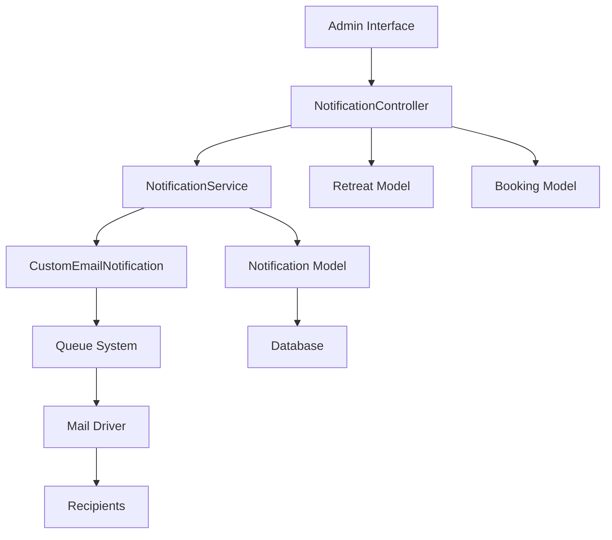
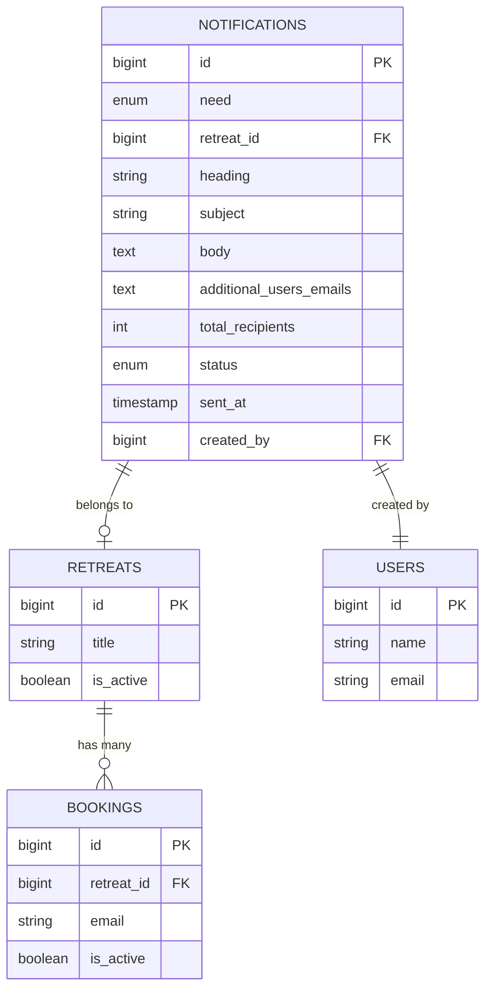

# Design Document

## Overview

The custom email notification system is designed as a comprehensive email management module for the retreat management application. It enables administrators to send targeted email communications to retreat participants and custom recipient lists. The system integrates seamlessly with Laravel's existing notification framework and queue system, following the application's established patterns for email delivery (similar to BookingConfirmation and BookingCancellation emails).

The architecture follows Laravel's MVC pattern with additional service layer components for business logic. The system uses database-backed queues for reliable asynchronous email delivery and maintains a complete audit trail of all notifications sent through the platform.

## Architecture

### High-Level Architecture



### Component Layers

1. **Presentation Layer**: Blade templates for UI (index, compose form)
2. **Controller Layer**: NotificationController for request handling
3. **Service Layer**: NotificationService for business logic
4. **Model Layer**: Notification model for data persistence
5. **Notification Layer**: CustomEmailNotification for email composition
6. **Queue Layer**: Laravel queue system for asynchronous processing
7. **Mail Layer**: Laravel mail driver for email delivery

## Components and Interfaces

### 1. Database Schema

#### Notifications Table

```sql
CREATE TABLE notifications (
    id BIGINT UNSIGNED AUTO_INCREMENT PRIMARY KEY,
    need ENUM('retreat', 'custom') NOT NULL,
    retreat_id BIGINT UNSIGNED NULL,
    heading VARCHAR(255) NOT NULL,
    subject VARCHAR(255) NOT NULL,
    body TEXT NOT NULL,
    additional_users_emails TEXT NULL,
    total_recipients INT UNSIGNED NOT NULL DEFAULT 0,
    status ENUM('pending', 'queued', 'processing', 'sent', 'failed', 'partially_sent') NOT NULL DEFAULT 'pending',
    sent_at TIMESTAMP NULL,
    created_by BIGINT UNSIGNED NOT NULL,
    created_at TIMESTAMP DEFAULT CURRENT_TIMESTAMP,
    updated_at TIMESTAMP DEFAULT CURRENT_TIMESTAMP ON UPDATE CURRENT_TIMESTAMP,
    
    FOREIGN KEY (retreat_id) REFERENCES retreats(id) ON DELETE SET NULL,
    FOREIGN KEY (created_by) REFERENCES users(id) ON DELETE CASCADE,
    INDEX idx_need (need),
    INDEX idx_status (status),
    INDEX idx_created_at (created_at)
);
```

#### Queue Tables

The system will use Laravel's existing queue tables:
- `jobs` - For queued email jobs
- `failed_jobs` - For failed email jobs
- `job_batches` - For batch tracking (optional)

### 2. Models

#### Notification Model

**Location**: `app/Models/Notification.php`

**Responsibilities**:
- Represent notification records
- Define relationships with Retreat and User models
- Provide query scopes for filtering
- Handle status transitions

**Key Methods**:
```php
// Relationships
public function retreat(): BelongsTo
public function creator(): BelongsTo

// Scopes
public function scopeByNeed($query, string $need)
public function scopeByStatus($query, string $status)
public function scopeRecent($query)

// Helpers
public function getRecipientsArray(): array
public function markAsQueued(): void
public function markAsSent(): void
public function markAsFailed(): void
```

**Attributes**:
- Fillable: need, retreat_id, heading, subject, body, additional_users_emails, total_recipients, status, sent_at, created_by
- Casts: sent_at (datetime), total_recipients (integer)
- Appends: recipients_count, formatted_status

### 3. Controllers

#### NotificationController

**Location**: `app/Http/Controllers/Admin/NotificationController.php`

**Responsibilities**:
- Handle HTTP requests for notification management
- Validate form inputs
- Delegate business logic to NotificationService
- Return appropriate views and responses

**Key Methods**:
```php
public function index(): View
// Display paginated list of notifications

public function create(): View
// Show notification composition form with active retreats

public function store(StoreNotificationRequest $request): RedirectResponse
// Validate and create new notification, dispatch to queue

public function show(Notification $notification): View
// Display notification details (optional)
```

### 4. Requests

#### StoreNotificationRequest

**Location**: `app/Http/Requests/StoreNotificationRequest.php`

**Validation Rules**:
```php
[
    'need' => 'required|in:retreat,custom',
    'retreat_id' => 'required_if:need,retreat|exists:retreats,id',
    'heading' => 'required|string|max:255',
    'subject' => 'required|string|max:255',
    'body' => 'required|string',
    'additional_users_emails' => 'nullable|string',
]
```

**Custom Validation**:
- Validate comma-separated emails in additional_users_emails
- Ensure at least one recipient exists (retreat participants or custom emails)
- Validate retreat is active when need is 'retreat'

### 5. Services

#### NotificationService

**Location**: `app/Services/NotificationService.php`

**Responsibilities**:
- Encapsulate notification business logic
- Calculate total recipients
- Parse and validate email addresses
- Create notification records
- Dispatch notification jobs to queue

**Key Methods**:
```php
public function createNotification(array $data): Notification
// Create notification record and dispatch to queue

public function getRecipients(Notification $notification): array
// Get all email addresses for a notification

public function parseEmails(string $emailString): array
// Parse comma-separated emails and validate

public function dispatchNotification(Notification $notification): void
// Dispatch notification to queue system

private function getRetreatParticipantEmails(int $retreatId): array
// Get emails of all active bookings for a retreat

private function calculateTotalRecipients(array $data): int
// Calculate total number of recipients
```

### 6. Notifications

#### CustomEmailNotification

**Location**: `app/Notifications/CustomEmailNotification.php`

**Responsibilities**:
- Define notification delivery channels
- Compose email message
- Implement Queueable interface for async delivery

**Structure**:
```php
class CustomEmailNotification extends Notification implements ShouldQueue
{
    use Queueable;
    
    public function __construct(
        public string $heading,
        public string $subject,
        public string $body
    ) {}
    
    public function via($notifiable): array
    {
        return ['mail'];
    }
    
    public function toMail($notifiable): MailMessage
    {
        return (new MailMessage)
            ->subject($this->subject)
            ->view('emails.custom-notification', [
                'heading' => $this->heading,
                'body' => $this->body,
            ]);
    }
}
```

### 7. Jobs

#### SendNotificationToRecipients

**Location**: `app/Jobs/SendNotificationToRecipients.php`

**Responsibilities**:
- Process notification sending in background
- Send notification to each recipient
- Update notification status
- Handle failures gracefully

**Structure**:
```php
class SendNotificationToRecipients implements ShouldQueue
{
    use Dispatchable, InteractsWithQueue, Queueable, SerializesModels;
    
    public function __construct(
        public Notification $notification,
        public array $recipients
    ) {}
    
    public function handle(): void
    {
        // Send notification to each recipient
        // Update notification status
    }
    
    public function failed(Throwable $exception): void
    {
        // Mark notification as failed
    }
}
```

### 8. Views

#### Index View

**Location**: `resources/views/admin/notifications/index.blade.php`

**Features**:
- DataTable with server-side processing
- Columns: ID, DateTime, Need, Retreat ID, Recipients Count, Additional Emails, Status, Actions
- "Compose Mail" button
- Status badges with color coding
- Pagination
- Search and filter capabilities

#### Compose Form View

**Location**: `resources/views/admin/notifications/create.blade.php`

**Features**:
- Need type selector (retreat/custom) with dynamic form fields
- Active retreats dropdown (shown when need=retreat)
- Additional emails textarea with comma-separated format
- Heading input field
- Subject input field
- Body textarea with CKEditor for rich text
- Form validation with error display
- Submit button with loading state

#### Email Template View

**Location**: `resources/views/emails/custom-notification.blade.php`

**Features**:
- Consistent branding with existing booking emails
- Dynamic heading display
- Dynamic body content with preserved formatting
- Footer with retreat center information
- Responsive design

## Data Models

### Notification Model Attributes

| Attribute | Type | Description |
|-----------|------|-------------|
| id | bigint | Primary key |
| need | enum | Type: 'retreat' or 'custom' |
| retreat_id | bigint | Foreign key to retreats (nullable) |
| heading | string | Email heading/title |
| subject | string | Email subject line |
| body | text | Email body content |
| additional_users_emails | text | Comma-separated additional emails |
| total_recipients | integer | Total number of recipients |
| status | enum | Status: pending, queued, processing, sent, failed, partially_sent |
| sent_at | timestamp | When notification was sent |
| created_by | bigint | Foreign key to users |
| created_at | timestamp | Record creation time |
| updated_at | timestamp | Record update time |

### Relationships



## Error Handling

### Validation Errors

**Scenario**: Invalid form input
**Handling**: 
- Display validation errors above form fields
- Preserve user input
- Highlight invalid fields in red
- Show specific error messages for each field

### Email Sending Failures

**Scenario**: Email fails to send to one or more recipients
**Handling**:
- Log error details to Laravel log
- Update notification status to 'failed' or 'partially_sent'
- Retry failed jobs according to queue configuration
- Store failed jobs in failed_jobs table for manual review

### Queue Processing Failures

**Scenario**: Queue worker stops or crashes
**Handling**:
- Jobs remain in queue for processing when worker restarts
- Implement job timeout and retry logic
- Monitor queue health through Laravel Horizon (optional) or logs
- Alert administrators of persistent failures

### Database Errors

**Scenario**: Database connection issues or constraint violations
**Handling**:
- Wrap database operations in try-catch blocks
- Display user-friendly error messages
- Log detailed error information
- Rollback transactions on failure

### Invalid Email Addresses

**Scenario**: Malformed email addresses in additional_users_emails
**Handling**:
- Validate email format before saving
- Display specific validation errors
- Filter out invalid emails and proceed with valid ones (optional)
- Provide clear feedback on which emails are invalid

## Testing Strategy

### Unit Tests

**Location**: `tests/Unit/`

**Coverage**:
1. **NotificationService Tests**
   - Test email parsing and validation
   - Test recipient calculation
   - Test notification creation
   - Test error handling

2. **Notification Model Tests**
   - Test relationships
   - Test scopes
   - Test status transitions
   - Test attribute casting

3. **Request Validation Tests**
   - Test validation rules
   - Test custom validation logic
   - Test error messages

### Feature Tests

**Location**: `tests/Feature/`

**Coverage**:
1. **Notification Management Tests**
   - Test index page displays notifications
   - Test compose form displays correctly
   - Test notification creation with retreat
   - Test notification creation with custom emails
   - Test validation errors
   - Test authorization checks

2. **Email Sending Tests**
   - Test emails are queued
   - Test emails are sent to correct recipients
   - Test email content is correct
   - Test status updates after sending

3. **Integration Tests**
   - Test end-to-end notification flow
   - Test queue processing
   - Test error recovery

### Manual Testing Checklist

1. **UI Testing**
   - Verify sidebar menu item appears
   - Verify index page layout and data
   - Verify compose form functionality
   - Verify dynamic form field behavior
   - Verify validation error display

2. **Functional Testing**
   - Create retreat notification
   - Create custom notification
   - Verify emails are received
   - Verify status updates
   - Test with large recipient lists

3. **Queue Testing**
   - Verify jobs are queued
   - Verify queue worker processes jobs
   - Test job failure and retry
   - Monitor queue performance

## Security Considerations

### Authorization

- Implement permission-based access control
- Create 'view-notifications', 'create-notifications' permissions
- Restrict access to admin users only
- Validate user permissions in controller methods

### Input Validation

- Sanitize all user inputs
- Validate email addresses strictly
- Prevent SQL injection through Eloquent ORM
- Escape output in Blade templates

### Email Security

- Prevent email header injection
- Validate recipient email addresses
- Implement rate limiting for email sending
- Use authenticated SMTP connection

### Data Privacy

- Store only necessary recipient information
- Implement data retention policies
- Provide audit trail of sent notifications
- Comply with email marketing regulations (if applicable)

## Performance Considerations

### Queue Optimization

- Use database queue driver for reliability
- Configure appropriate queue workers
- Implement job batching for large recipient lists
- Set reasonable job timeout values

### Database Optimization

- Index frequently queried columns (status, created_at, need)
- Paginate notification list
- Use eager loading for relationships
- Archive old notifications periodically

### Email Delivery Optimization

- Batch email sending to avoid rate limits
- Implement exponential backoff for retries
- Use connection pooling for SMTP
- Monitor email delivery metrics

## Deployment Considerations

### Queue Configuration

1. Ensure queue tables are migrated
2. Configure queue connection in .env
3. Start queue worker: `php artisan queue:work`
4. Consider using Supervisor for worker management
5. Monitor queue health and performance

### Email Configuration

1. Configure mail driver in .env (SMTP, Mailgun, etc.)
2. Set up mail credentials
3. Test email delivery in staging environment
4. Configure mail from address and name

### Migration Steps

1. Run database migrations
2. Seed permissions if using permission system
3. Clear config cache: `php artisan config:clear`
4. Clear route cache: `php artisan route:clear`
5. Start queue worker
6. Test notification creation and delivery

## Future Enhancements

1. **Email Templates**: Pre-defined email templates for common scenarios
2. **Scheduling**: Schedule notifications for future delivery
3. **Analytics**: Track email open rates and click-through rates
4. **Attachments**: Support file attachments in notifications
5. **Recipient Groups**: Create and manage recipient groups
6. **Email Preview**: Preview email before sending
7. **Draft Notifications**: Save notifications as drafts
8. **Notification History**: View detailed delivery history per recipient
9. **Bulk Actions**: Resend or cancel multiple notifications
10. **API Integration**: REST API for notification management
